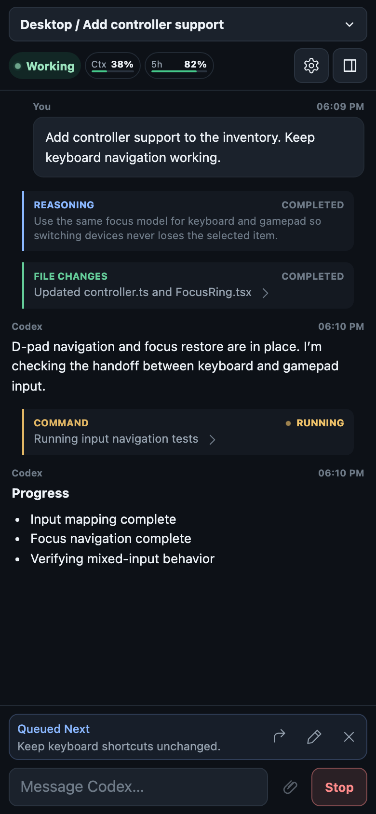
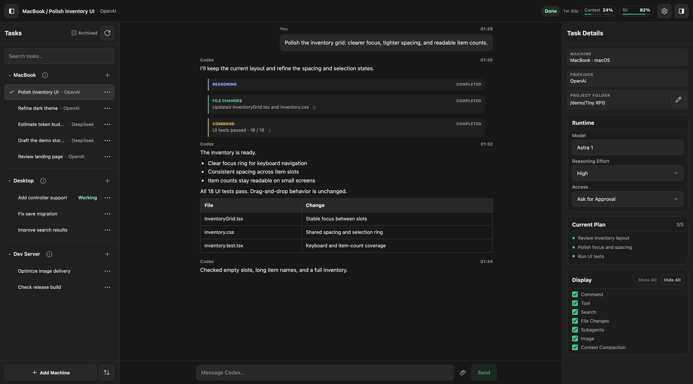
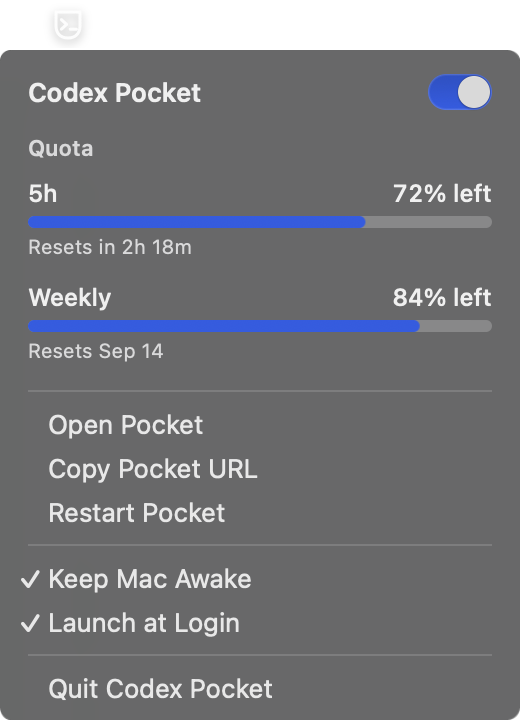

# Codex Pocket

Codex Pocket is a lightweight, self-hosted browser/PWA client for controlling official Codex app-server runtimes locally and over SSH. Run its small Node.js gateway from the macOS menu bar or headlessly, then manage tasks from your desktop or phone.

Codex Pocket is an unofficial community project and is not affiliated with or endorsed by OpenAI.

## Screenshots

Real Pocket UI with synthetic demo data only, including all tasks, machines, conversations, and usage figures.

| Monitor and control from your phone | Switch tasks across machines |
| --- | --- |
|  |  |

<details>
<summary>macOS menu-bar host</summary>



</details>

## What it does

- Select and resume saved tasks across local and SSH runtimes; create a named task in a chosen project folder, or use **Rename**, **Archive**, **Unarchive**, and **Delete** from its action menu. Deletion requires confirmation.
- Follow live messages, user-facing reasoning summaries, command/tool activities, file-change diffs, plans, and turn status. Activity details load on demand.
- Respond to supported approvals and structured questions, including async questions with choices or free-text answers.
- Choose the model, reasoning effort, and access mode exposed by the selected runtime.
- Send messages, stop an active turn, or queue one message for the next turn. **Steer Now** in the queue banner injects that queued message into the active turn; **Cancel** removes it.
- Send images with text or on their own using the image picker or desktop clipboard paste. Removable thumbnails remain available in the fullscreen composer, and images travel with queued/steered messages. Sent images remain viewable from live messages and history where Codex exposes them. Input supports PNG, JPEG, GIF, and WebP: up to four images, 4 MB each and 8 MB combined.
- View surfaced assistant images inline and in a fullscreen viewer, including supported local-file references fetched through the gateway or SSH. Remote Markdown images are not loaded; unavailable images show useful alt text.
- See account quota and a **Ctx** chip showing context-window percentage used from authoritative app-server usage. Without usage replay or a live update, it shows **Ctx —**. Context and quota can each be hidden under Settings → Appearance for this browser.
- Browse bounded, paginated history in a mobile-focused UI with themes, display toggles, a fullscreen composer, and a browser-local **Enter Sends Message** preference.

Settings changes take effect only on **Save**, including browser-local appearance and input preferences. Save is enabled only while values differ from those loaded; **Cancel**, **X**, and **Escape** discard unsaved edits. A successful save closes Settings unless a restart is required, when **Restart Pocket** is brought into view. Display controls in the inspector still apply immediately when Settings is closed.

**Translucent UI** is available on mobile (up to 860px wide) and defaults on. **Enter Sends Message** defaults on for desktop and off for mobile on first use; an existing saved choice takes precedence and does not change on resize.

The image viewer supports double-tap zoom/reset, pinch zoom, panning while zoomed, and desktop wheel zoom. Close it with **X**, **Escape**, or a tap outside the image. Dragging at 1× neither moves nor dismisses the image.

While a turn is active, normal **Send** queues input; answering an async question steers immediately into its original active turn, or starts a follow-up if that turn has ended. A queue starts automatically after normal completion and stays parked after Stop. Steering clears it only after successful delivery. Queues live in gateway memory and survive task switches, but are lost on gateway restart. A queue stays parked while its task is away; returning alone does not send it. They cannot be edited or expanded into multiple queued messages.

Text and image drafts are task-scoped and kept only in browser memory: up to eight recent non-empty drafts. They do not survive a page reload.

## Requirements

- Node.js **22.6 or newer**, with npm. Pocket uses Node's `--experimental-strip-types` flag.
- An authenticated Codex CLI on each runtime machine, with `codex app-server proxy` and a running shared/managed app-server. Current functionality has been exercised with **Codex CLI 0.153.4**; available controls depend on the runtime's protocol support.
- macOS for the menu-bar host. The checked-in app executable is **Apple Silicon (arm64)**; rebuilding requires Apple's command-line developer tools.
- For remote machines, working non-interactive SSH from the Pocket host and `codex` available in the remote SSH command environment.

Codex Desktop itself is not required. Running Desktop alone does not necessarily start the shared runtime Pocket needs.

## macOS quick start

**Network boundary:** Pocket can control Codex runtimes and may approve powerful actions depending on the selected access mode. Its four-digit PIN is a convenience gate for trusted LAN/private-network use, **not internet-grade authentication**. **DO NOT port-forward Pocket directly to the public internet.** For remote access, use a private encrypted network/VPN such as WireGuard or Tailscale. Pocket serves HTTP and defaults to **localhost (`127.0.0.1:4173`)** unless LAN access is explicitly enabled.

1. Clone this repository and install dependencies:

   ```sh
   git clone https://github.com/oksklok/codex-pocket.git
   cd codex-pocket
   npm install
   ```

2. Authenticate Codex if necessary and start its existing shared runtime:

   ```sh
   codex login
   codex app-server daemon start
   ```

   To work in that runtime from the terminal as well, use `codex --remote unix://`. Use **New Task** in the switcher to create and select an empty task immediately, then send your first real message. No placeholder message is inserted; Codex may omit empty tasks from its persisted saved-task list until the first turn finishes.

3. Double-click **Codex Pocket.app**, then choose **Open Pocket** from its menu-bar icon. Keep the app bundle inside the repository so it can find the gateway and dependencies. The host locates a compatible Node executable in common install locations or the Codex bundled runtime.

4. Open the task selector in the top bar to browse machines and saved tasks in the Tasks drawer.

For a phone, open web **Settings**, enable local-network access, choose the bind address/port, and set a four-digit PIN. Save and choose **Restart Pocket** if prompted, then open the displayed phone URL and enter the PIN over your trusted network.

Phone URLs include local LAN and Tailscale/CGNAT IPv4 addresses (`100.64.0.0/10`). Use these only over a trusted LAN or private VPN.

Closing browser tabs leaves the gateway running. The menu bar provides a gateway power switch, **Keep Mac Awake**, **Launch at Login** where supported, and **Quit Codex Pocket**. The app is not distributed as a notarized installer; you can rebuild it locally with `macos/build-app.sh`.

## Standalone mobile app (PWA)

Pocket includes a web app manifest and can launch as a standalone PWA without normal browser chrome. Adding a raw LAN HTTP URL such as `http://192.168.x.x:4173` to the home screen creates only a browser shortcut. A true standalone install requires a **trusted HTTPS origin**.

For private access, keep Pocket on HTTP internally and put a small HTTPS reverse proxy such as Caddy in front of it. Keep the HTTPS endpoint reachable only over a trusted LAN, WireGuard, or another private VPN. Caddy's internal CA is suitable if the Android device trusts that CA.

Open the trusted HTTPS URL in Edge/Chromium on Android, choose **Add to phone / Install app** from the browser menu, and launch the installed icon. It should open without the normal address bar or tab controls. No service worker or offline caching is required for this standalone use case; Pocket still needs a live connection to its gateway.

Keep Caddy configuration, certificates, CA private keys, and all other machine-local HTTPS material outside the repository. Do not commit them. HTTPS does not change Pocket's [private-network security boundary](SECURITY.md).

## SSH machines

On each remote machine, authenticate Codex and start its shared app-server. From the Pocket host, verify an existing SSH alias works without prompting:

```sh
ssh -o BatchMode=yes devbox codex --version
```

Then use **Settings → Machines → Add Machine**, enter a display name and SSH alias such as `devbox`, save, and restart Pocket. Pocket launches `codex app-server proxy` through that alias and uses the host's existing SSH configuration, keys, and agent. It does not store SSH credentials. A remote Codex Desktop installation is unnecessary.

Disconnected runtimes retry after 5, 10, 20, 30, then 60 seconds, staying at 60 seconds until a successful connection resets the delay. Transport establishment has a 15-second timeout.

Server-backed settings are stored in the Git-ignored `.codex-pocket.local.json`; appearance, input, and display preferences stay in each browser’s local storage. Local config, runtime records, and logs should stay private. If the Mac runtime is unavailable, check that its shared daemon is running; Pocket also shows a concise underlying connection or task-ownership error.

## Architecture and limits

```text
Local / SSH Codex app-server runtimes
                ↓ supported protocol
         Node.js Pocket gateway
                ↓ filtered SSE + paginated history
         Desktop / mobile browser
```

Pocket uses supported app-server protocol surfaces. It does not scrape Codex databases, rollout/session files, terminal output, or Desktop UI. Desktop-private, stdio-owned live sessions are not attachable through Pocket; a saved task owned by another runtime may also refuse attachment.

Active, archived, and loaded-task catalogs fetch every cursor page, with no fixed task-count cap. Search covers the complete fetched catalog. Only the selected machine holds a task attachment; other configured machines stay connected for catalogs, status, and quota without retaining task writer ownership. A cross-machine switch attaches the destination first, then releases the previous task. A failed destination attachment leaves the current task intact.

Task attachment uses `thread/resume` with `excludeTurns: true`. History stays bounded through `thread/turns/list` and `thread/items/list`, with older pages loaded as you scroll and activity details fetched lazily. Pocket never requests full history just to obtain context usage, and it does not estimate tokens. Raw app-server events are not forwarded wholesale to browsers.

Image transport is limited to validated image input and images surfaced by trusted Codex items; it is not a general file browser or arbitrary-file endpoint. Access, approvals, model settings, and message controls remain subject to what the selected app-server supports.

## Development

```sh
npm install
npm start
npm test
```

`npm start` runs the gateway directly without the menu-bar host and uses the same saved settings. With no saved LAN configuration it listens on localhost. `CODEX_BIN` can select a local Codex executable; `--host`, `--port`, and `CODEX_POCKET_PIN` override saved network settings. Non-loopback listening requires a four-digit PIN and the network precautions above.

Build the native host with `macos/build-app.sh`. For a read-only connectivity check, use `npm run probe -- --list-only` or `npm run probe-remote -- devbox --list-only`. [SPIKE_REPORT.md](SPIKE_REPORT.md) records the original historical experiment, not the current feature list.

See [CONTRIBUTING.md](CONTRIBUTING.md) for contribution basics and [SECURITY.md](SECURITY.md) for security guidance. Licensed under the [MIT License](LICENSE). `package.json` deliberately retains `"private": true` to prevent accidental npm publication.

## Docker / headless hosts

Docker runs Pocket as an SSH-runtime-only gateway; it does not run Codex locally in the container. Install Docker with Compose, clone this repository, and prepare two private directories beside `compose.yaml`:

- `data/.codex-pocket.local.json`: Pocket settings with `lanEnabled: true`, `host: "0.0.0.0"`, `port: 4173`, your four-digit `pin`, and `machines` entries containing a display `name` and SSH alias (`ssh`). You can copy an existing Pocket settings file and adjust the machines.
- `ssh/`: a dedicated outbound SSH key, `config`, and verified `known_hosts`. Each alias must specify its host, user, and `IdentityFile ~/.ssh/id_ed25519`. Install only this key's public half on the runtime machines. Protect the directories and private key with permissions 700 and 600 respectively.

The supplied container uses the image’s non-root `node` user (UID 1000). The mounted data and SSH files must be owned by UID 1000. Compose mounts SSH files read-only (`./ssh:/home/node/.ssh:ro`); provision keys and verified host records before starting Pocket. It has no privileged mode, Docker socket, or host filesystem access beyond these two mounts. Verify each alias can run `codex --version` and reach its shared Codex app-server before using Pocket.

```sh
docker compose up -d --build
```

Open the host's LAN or Tailscale IPv4 address on port 4173 and sign in with your existing PIN. Use LAN/private VPN access only: the PIN is a convenience gate, not internet-grade authentication. **Never port-forward Pocket directly to the internet.**

`CODEX_POCKET_DATA_DIR` keeps writable settings and runtime markers separate from application files. `CODEX_POCKET_HEADLESS=1` requires at least one SSH machine, omits the local runtime, and makes Restart Pocket exit cleanly for Compose to restart it. Headless Settings cannot change the container-owned bind address/port and must retain at least one SSH machine. Stop with `docker compose down`; the web Quit action is disabled. Neither variable changes the normal macOS host defaults when unset.
